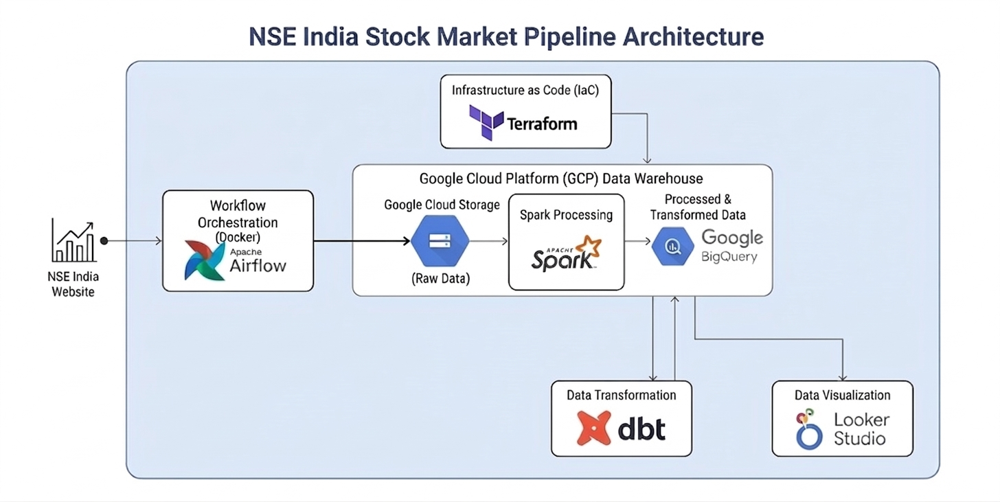
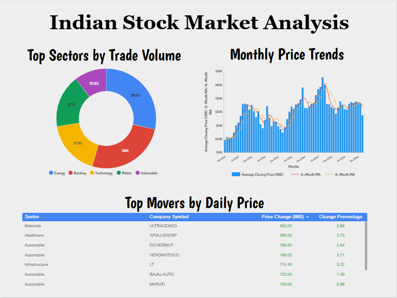

# 📊 Indian Stock Market Data Pipeline
### 🧭 Introduction

The `Indian Stock Market Data Pipeline` is an end-to-end data engineering project designed to ingest, process, and store stock market data from the Indian equity markets (primarily NSE). The project demonstrates how modern data engineering tools can be combined to build a scalable, cloud-native pipeline.

The pipeline automates the process of:

* Downloading daily stock market datasets (bhavcopy)
* Storing raw data in cloud storage
* Transforming and loading data into a data warehouse
* Enabling analytics and querying for downstream use cases

This project is built as a practical implementation of real-world data engineering concepts including orchestration, cloud storage, and data warehousing.

### ❗ Problem Statement

Stock market data is:

* Highly dynamic (updated daily)
* Large in volume
* Unstructured or semi-structured when downloaded
* Difficult to manage manually over time

For analysts, traders, and data scientists, there is a need for:

1. Automated data ingestion
    * Manual downloads are inefficient and error-prone
2. Reliable storage system
    * Historical data must be preserved and easily accessible
3. Efficient querying
    * Raw CSV files are not suitable for analytics at scale
4. Scalable architecture
    * The system should handle growing data without redesign

#### Objective

To build a fully automated, scalable data pipeline that:

* Extracts stock market data daily
* Stores it reliably in cloud storage
* Transforms it into structured formats
* Loads it into a data warehouse for analysis
### 📦 Dataset

#### 📍 Source

The dataset used in this project is the **NSE Bhavcopy dataset**, which contains daily trading information for all listed securities. We are using the data for Top 50 stocks on NSE, in the last 5 years for our pipeline.

Typical source:

* [National Stock Exchange of India](https://www.nseindia.com/) official website
* Example format (bhavcopy ZIP/CSV files)

### 📊 Dataset Description

Each file represents one trading day and contains records for all traded stocks.

| Field             | Definition                                             |
| ----------------- | ------------------------------------------------------ |
| **SYMBOL**        | Stock ticker symbol of the company                     |
| **SERIES**        | Security type (e.g., EQ = Equity, BE = Trade-to-trade) |
| **DATE1**         | Trading date of the record                             |
| **PREV_CLOSE**    | Closing price from the previous trading day            |
| **OPEN_PRICE**    | Price at which the stock opened for the day            |
| **HIGH_PRICE**    | Highest price reached during the trading session       |
| **LOW_PRICE**     | Lowest price reached during the trading session        |
| **LAST_PRICE**    | Last traded price before market close                  |
| **CLOSE_PRICE**   | Official closing price of the stock                    |
| **AVG_PRICE**     | Volume-weighted average price (VWAP) of the day        |
| **TTL_TRD_QNTY**  | Total quantity of shares traded during the day         |
| **TURNOVER_LACS** | Total traded value in lakhs (1 lakh = 100,000)         |
| **NO_OF_TRADES**  | Total number of executed trades                        |
| **DELIV_QTY**     | Quantity of shares delivered (not intraday)            |
| **DELIV_PER**     | Percentage of traded quantity that was delivered       |


## Tech Stack
* GCP (GCS, BigQuery)
* Terraform
* Airflow
* Spark
* dbt
* Looker Studio

## Project Structure
The database has the following architecture:



## Usability
### Step 1: Environment & Cloud Setup
Before running any code, you need a Google Cloud Platform (GCP) project and the necessary credentials.
1. **Create a GCP Project**: Go to the GCP Console and create a project (e.g., `nse-pipeline-2026`).
2. **Enable APIs**: Enable the BigQuery and Cloud Storage APIs.
3. **Create a Service Account**:
    - Go to **IAM & Admin > Service Accounts**.
    - Create an account named `dbt-runner`.
    - Grant these roles: `BigQuery Admin`, `Storage Object Admin`, `Storage Insights Viewer`.
    - **Create a JSON Key**: Actions > Manage Keys > Add Key > Create New Key (JSON). Save this as `creds.json`.

4. Install Tools: Ensure you have the Google Cloud SDK, Terraform, and Python 3.9+ installed.
    #### 1. Google Cloud SDK (gcloud CLI)
    The Google Cloud SDK is required to authenticate with GCP and manage cloud resources from the terminal.

    ```bash
    # Update package list and install dependencies
    sudo apt-get update
    sudo apt-get install apt-transport-https ca-certificates gnupg curl -y

    # Import the Google Cloud public key
    curl https://packages.cloud.google.com/apt/doc/apt-key.gpg | sudo gpg --dearmor -o /usr/share/keyrings/cloud.google.gpg

    # Add the gcloud SDK repo to your system
    echo "deb [signed-by=/usr/share/keyrings/cloud.google.gpg] https://packages.cloud.google.com/apt cloud-sdk main" | sudo tee -a /etc/apt/sources.list.d/google-cloud-sdk.list

    # Install the SDK
    sudo apt-get update && sudo apt-get install google-cloud-cli -y

    # Verify installation
    gcloud --version
    ```

    #### 2. Terraform
    Terraform is used to provision the GCS buckets and BigQuery datasets as Infrastructure as Code.

    ```bash
    # Install HashiCorp's GPG key
    wget -O- https://apt.releases.hashicorp.com/gpg | sudo gpg --dearmor -o /usr/share/keyrings/hashicorp-archive-keyring.gpg

    # Add the official HashiCorp repository
    echo "deb [signed-by=/usr/share/keyrings/hashicorp-archive-keyring.gpg] https://apt.releases.hashicorp.com/$(lsb_release -cs) main" | sudo tee /etc/apt/sources.list.d/hashicorp.list

    # Install Terraform
    sudo apt update && sudo apt install terraform -y

    # Verify installation
    terraform -version
    ```
    #### 3. Python 3.9+ & Virtual Environment
    Python is used for data ingestion scripts and dbt.

    ```bash
    # Update and install Python, Pip, and Venv
    sudo apt update
    sudo apt install python3 python3-pip python3-venv -y

    # Verify version (ensure it is 3.9 or higher)
    python3 --version

    # Create and activate a virtual environment for the project
    python3 -m venv venv
    source venv/bin/activate
    ```

### Step 2: Infrastructure as Code (Terraform)
We use Terraform to provision a **GCS bucket** (Data Lake) and a **BigQuery dataset** (Data Warehouse).
1. Initialize Terraform:
    
    ```bash
    cd terraform
    terraform init
    ```
2. Apply Configuration: Replace the variable with your actual Project ID.
    
    ```bash
    terraform apply -var="project_id=YOUR_PROJECT_ID" -var="region=asia-south1"
    ```
    
    Note: This creates the `stock-market-lake` bucket and `india_stock_market` dataset.

### Step 3: Orchestration & Ingestion (Apache Airflow)
The ingestion layer is managed by Apache Airflow. The DAG is responsible for scraping the NSE website and landing the raw data.
1. Initialize & Create Admin:
    
    ```bash
    # Initialize metadata DB
    docker compose run airflow-webserver airflow db init

    # Create UI user
    docker compose run airflow-webserver airflow users create \
        --username <YOUR_USERNAME> \
        --role Admin \
        --email <YOUR_EMAIL> \
        --password <YOUR_PASSWORD>
    ```
2. Execution Logic:
    - Schedule: `30 14 * * *` (14:30 UTC daily).

    - Task: Scrapes the previous day's trading data and uploads it as raw CSV files to `gs://<YOUR_BUCKET_NAME>/raw/nse/`.

### Step 4: Data Transformation (Spark)
Once the raw data is landed, a dedicated Spark container processes the data to make it "Analytics Ready."
1. **The Processing Logic**:
    * **Sector Mapping**: Joins the `SYMBOL` from the raw data with the `sector_mapping.csv` mapping file.
    * **Format Conversion**: Selects the necessary fields and converts raw CSV to Parquet for optimized BigQuery performance.
    * **Partitioning**: Writes the data to `gs://<YOUR_BUCKET_NAME>/processed/nse/` using Hive-style partitioning (e.g., `/TRADE_DATE=YYYY-MM-DD/`).
2. **Submit the Spark Job**:
    Run this command from your Spark container to trigger the transformation:
    
    ```bash
    /opt/spark/bin/spark-submit \
    --conf spark.hadoop.fs.gs.impl=com.google.cloud.hadoop.fs.gcs.GoogleHadoopFileSystem \
    --conf spark.hadoop.fs.AbstractFileSystem.gs.impl=com.google.cloud.hadoop.fs.gcs.GoogleHadoopFS \
    --conf spark.hadoop.google.cloud.auth.service.account.enable=true \
    --conf spark.hadoop.google.cloud.auth.service.account.json.keyfile=/app/creds.json \
    spark/nse_spark_job.py
    ```

### Step 5: Analytics Engineering (dbt)
With the partitioned Parquet data sitting in the `/processed/` folder, dbt takes over to create the final warehouse tables.
1. Installation & Virtual Environment
    
    Isolate dbt to prevent version conflicts with other Python tools like Airflow or Spark.
    
    ```bash
    # Create and activate a virtual environment
    python3 -m venv dbt-env
    source dbt-env/bin/activate

    # Install dbt for BigQuery
    pip install dbt-bigquery
    ```
2. Project Initialization
    
    Initialize the `nse_analytics` project. This creates the required folder structure and a `profiles.yml` file.
    
    ```bash
    dbt init nse_analytics
    ```
    Settings to choose during the wizard:
        
    * Database: `bigquery`
    * Method: `service_account`
    * Keyfile: `/path/to/<YOUR_CREDS>.json`
    * Project: `<YOUR_GCP_PROJECT_ID>`
    * Dataset: `<YOUR_DATASET_NAME>`
    * Threads: `4`
    * Location: `asia-south1`

3. Defining the Data Source (`models/staging/src_nse.yml`)
    
    Instead of hardcoding table names in your SQL, define them in a `source.yml` file. This allows dbt to "know" about the table Spark created in BigQuery.
    
    Create `models/staging/src_nse.yml`:
    
    ```yaml
    version: 2

    sources:
    - name: staging
        database: <YOUR_GCP_PROJECT_ID>
        schema: <YOUR_DATASET_NAME>
        tables:
        - name: nse_processed_external
    ```
4. Refactoring the Staging Model (`models/staging/stg_nse.sql`)
    
    Now, update your staging model to use the {{ source() }} function. This links your model to the source defined above.
    
    ```sql
    {{ config(materialized='view') }}

    SELECT
    TRIM(SYMBOL) AS symbol,
    TRIM(SERIES) AS series,

    TRADE_DATE AS trade_date,

    CAST(PREV_CLOSE AS FLOAT64) AS prev_close,
    CAST(OPEN_PRICE AS FLOAT64) AS open_price,
    CAST(HIGH_PRICE AS FLOAT64) AS high_price,
    CAST(LOW_PRICE AS FLOAT64) AS low_price,
    CAST(CLOSE_PRICE AS FLOAT64) AS close_price,

    CAST(TTL_TRD_QNTY AS INT64) AS volume,
    CAST(TURNOVER_LACS AS FLOAT64) AS turnover,

    CAST(NO_OF_TRADES AS INT64) AS trades,
    CAST(DELIV_QTY AS INT64) AS delivery_qty,
    CAST(DELIV_PER AS FLOAT64) AS delivery_pct,

    TRIM(SECTOR) AS sector,

    {{ dbt_utils.generate_surrogate_key(['symbol', 'trade_date']) }} AS nse_id

    -- Use the source function instead of a hardcoded string
    FROM {{ source('staging', 'nse_processed_external') }}
    WHERE TRIM(SERIES) = 'EQ'
    ```
5. Managing Dependencies (`packages.yml`)
    
    To use advanced features like surrogate keys, you need the dbt-utils package. Create this file in the root of your dbt project.
   
    ```yaml
    packages:
    - package: dbt-labs/dbt_utils
        version: 1.3.3
    ```
    Install the package:
   
    ```bash
    dbt deps
    ```

6. Final Execution Workflow for verification
    
    To replicate the analytics layer from scratch, run these commands in order:
    
    ```bash
    # 1. Check connection to BigQuery
    dbt debug

    # 2. Run the staging model to verify data flow
    dbt run --select stg_nse
    ```

7. Core Analytics:
    
    To complete the Marts layer of your dbt project, you will create four SQL models. These models represent the "Gold" or "Business" layer of your architecture—they are designed specifically for Looker Studio to consume.

    Place these files in your `models/marts/` directory.

    1. **Sector Performance Model**
    
    This model aggregates daily data to show how different sectors are performing. It powers your sector-wise line and bar charts.

    File: `models/marts/sector_performance.sql`
    ```sql
    {{ config(materialized='table') }}

    SELECT
        sector,
        trade_date,
        ROUND(AVG(close_price), 2) AS avg_close,
        ROUND(SUM(turnover), 2) AS total_turnover_lacs,
        SUM(volume) AS total_volume,
        COUNT(DISTINCT symbol) AS stock_count
    FROM {{ ref('stg_nse') }}
    GROUP BY 1, 2
    ```
    2. **Stock Trends (Technical Analysis)**
    
    This model adds technical indicators like Moving Averages. We use Window Functions to look back at historical rows for each specific stock.

    File: `models/marts/stock_trends.sql`
    ```sql
    {{ config(materialized='table') }}

    WITH daily_metrics AS (
        SELECT 
            *,
            -- 7-day and 30-day moving averages
            AVG(close_price) OVER(PARTITION BY symbol ORDER BY trade_date ROWS BETWEEN 6 PRECEDING AND CURRENT ROW) AS ma_7,
            AVG(close_price) OVER(PARTITION BY symbol ORDER BY trade_date ROWS BETWEEN 29 PRECEDING AND CURRENT ROW) AS ma_30
        FROM {{ ref('stg_nse') }}
    )

    SELECT 
        *,
        ROUND(close_price - prev_close, 2) AS daily_change,
        ROUND(((close_price - prev_close) / NULLIF(prev_close, 0)) * 100, 2) AS daily_pct_change
    FROM daily_metrics
    ```
    3. **Top Movers (Daily Snapshot)**
    
    This model isolates the most recent trading day to identify the "Gainers" and "Losers." This is perfect for a high-impact table on your dashboard.

    File: `models/marts/top_movers.sql`
    ```sql
    {{ config(materialized='table') }}

    SELECT
        symbol,
        sector,
        trade_date,
        close_price,
        prev_close,
        ROUND(close_price - prev_close, 2) AS price_change,
        ROUND(((close_price - prev_close) / NULLIF(prev_close, 0)) * 100, 2) AS pct_change,
        volume,
        turnover
    FROM {{ ref('stg_nse') }}
    -- Filter for the latest available date in the dataset
    WHERE trade_date = (SELECT MAX(trade_date) FROM {{ ref('stg_nse') }})
    ```
    4. **Monthly Stock Trends**
    
    For long-term investors, daily noise is less important than monthly trends. This model truncates dates to the month level and calculates 3-month and 6-month averages.

    File: `models/marts/monthly_stock_trends.sql`
    ```sql
    {{ config(materialized='table') }}

    WITH monthly_aggregation AS (
        SELECT
            symbol,
            sector,
            DATE_TRUNC(trade_date, MONTH) AS month_date,
            AVG(close_price) AS avg_monthly_close,
            SUM(volume) AS total_monthly_volume
        FROM {{ ref('stg_nse') }}
        GROUP BY 1, 2, 3
    )

    SELECT
        *,
        -- Long-term trends
        AVG(avg_monthly_close) OVER(PARTITION BY symbol ORDER BY month_date ROWS BETWEEN 2 PRECEDING AND CURRENT ROW) AS ma_3_month,
        AVG(avg_monthly_close) OVER(PARTITION BY symbol ORDER BY month_date ROWS BETWEEN 5 PRECEDING AND CURRENT ROW) AS ma_6_month
    FROM monthly_aggregation
    ```

    #### Running the Full Marts Build
    Once these files are in place, run the following command to materialize them as tables in your BigQuery dataset:

    ```bash
    dbt build
    ```
### Step 6: Visualization (Looker Studio)
Finally, we connect BigQuery to Looker Studio to create a production-grade financial dashboard.
1. **Data Connection**: Connect to  `<YOUR_PROJECT_ID>.<YOUR_DATASET>` dataset.
2. **Dashboard Features**:
    * Sector Analysis: Powered by `sector_performance`, this chart filters the top 5 sectors by trading volume to identify where institutional money is moving.
    * Long-term Momentum: Leverages the `monthly_stock_trends` model to smooth out daily volatility and show 3-month and 6-month growth trajectories.
    * Market Overview (Top Movers): Uses the `top_movers` model to show daily gainers and losers with conditional green/red formatting.

Final Dashboard:



[View Dashboard](https://lookerstudio.google.com/s/lYhJcaQkmlA)